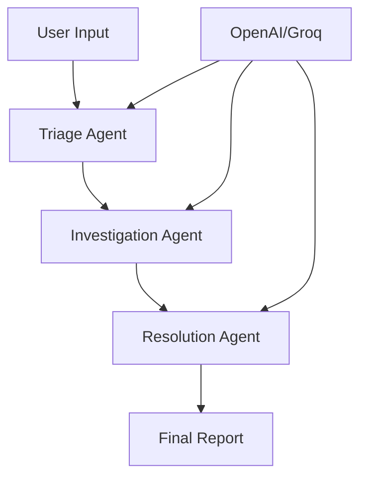

# 🏥 Hospital Crew AI

<div align="center">


[](https://python.org)
[](https://streamlit.io)
[](https://openai.com)
[](https://groq.com)
</div>

---
### Why Hospital Crew AI?
**An intelligent AI-powered healthcare complaint processing system that categorizes, investigates, and proposes resolutions for patient complaints using advanced multi-agent reasoning.**
- **Intelligent Triage**: Automatically categorizes complaints by severity and department
- **Multi-Agent Processing**: Specialized AI agents handle different aspects of complaint resolution
- **Fast Response**: Average processing time of 2.3 seconds
- **Comprehensive Reports**: Detailed analysis with downloadable documentation
- **24/7 Availability**: Round-the-clock complaint processing capability

---

## Features

### Core Functionality
-  **Flexible Input Methods**
  - Direct text input for custom complaints
  - Pre-configured test cases for demonstration
  
- **Multi-Provider AI Support**
  - OpenAI GPT models integration
  - Groq LLaMA models support
  - Easy provider switching

- **Intelligent Processing Pipeline**
  ```
  Complaint Input → Triage Agent → Investigation Agent → Resolution Agent → Final Report
  ```

### User Experience
- **Modern UI/UX**
  - Responsive gradient-styled interface
  - Dark/Light mode compatibility
  - Mobile-friendly design
  
- **Real-time Processing**
  - Live progress tracking
  - Step-by-step breakdown display
  - Animated status indicators

- **Comprehensive Reporting**
  - Detailed JSON reports
  - Timestamped processing logs
  - Downloadable documentation

---

## 📂 Project Structure

```
hospital-crew-ai/
├── app.py                 
├── agents.py              
├── test_cases.py         
├── requirements.txt      
├── hospital_crew.py      
├── hospital_data.py
├── llm_client.py
├── tools.py                        
├── .env                   
```

---

## Installation & Setup

### Prerequisites
- Python 3.8 or higher
- OpenAI API key 
- Groq API key 

### 1️⃣ Clone the Repository
```bash
git clone https://github.com/your-username/hospital-crew-ai.git
cd hospital-crew-ai
```

### 2️⃣ Create Virtual Environment
```bash
# Create virtual environment
python -m venv venv

# Activate virtual environment
source venv/bin/activate    # On Linux/Mac
# OR
venv\Scripts\activate       # On Windows
```

### 3️⃣ Install Dependencies
```bash
pip install -r requirements.txt
```

### 4️⃣ Environment Configuration
Create a `.env` file in the project root:
```bash
# Copy the example file
cp .env.example .env

# Edit with your API keys
OPENAI_API_KEY=your_openai_api_key_here
GROQ_API_KEY=your_groq_api_key_here
```

### 5️⃣ Launch the Application
```bash
streamlit run app.py
```

The application will be available at `http://localhost:8501`

---

## 📖 Usage Guide

### Basic Usage
1. **Select AI Provider**: Choose between OpenAI or Groq
2. **Input Method**: Select direct input or pre-configured cases
3. **Enter Complaint**: Provide detailed healthcare concern description
4. **Process**: Click " Process Complaint" to begin analysis
5. **Review Results**: Examine the multi-step processing breakdown
6. **Download Report**: Save detailed JSON report for records

### Sample Input
```
"Patient waited 4 hours in emergency room with chest pain. 
Staff was unresponsive and failed to provide timely care. 
Patient eventually left without treatment due to excessive wait time."
```

### Expected Output
- **Triage Classification**: Emergency/High Priority
- **Department Assignment**: Emergency Medicine
- **Investigation Findings**: Staffing issues, protocol violations
- **Recommended Actions**: Staff training, process improvements

---

## 🏗️ Architecture

### Multi-Agent System


### Processing Flow
1. **Triage Agent**: Categorizes complaints by urgency and department
2. **Investigation Agent**: Analyzes root causes and contributing factors
3. **Resolution Agent**: Proposes actionable solutions and improvements
4. **Report Generator**: Compiles comprehensive documentation

---

<div align="center">

**Made with ❤️ for better healthcare**

</div>
